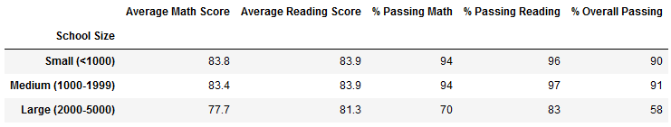

# School District Analysis

## Overview of Project

### Purpose
-- insert purpose here later --

## Results

* How is the district summary affected?
 *District Summary - Module DataFrame*

 *District Summary - Adjusted DataFrame*

 Ultimately, the district summary didn't see that much of an impact. There was a slight decrease in averages scores for math and reading, and in the percentage of students who passed, but because the students that were removed from the data were such a small piece of the dataset, its impact on a general level was small.
  
* How is the school summary affected?
 *School Summary - Module DataFrame*

 *School Summary - Adjusted DataFrame*

 Slight decrease in math score, slight increase in reading score, decrease in passing math, decrease in passing reading, decrease in passing overall
  
* How does replacing the ninth graders' math and reading scores affect Thomas High School's performance relative to the other schools?
 *Top Schools - Module DataFrame*

 *Top Schools - Adjusted DataFrame*

While there was a slight decrease in Thomas High School's overall performance, it was not significant enough to change its ranking when viewing all other schools.
  
* How does replacing the ninth-grade scores affect the following:
    * Math and Reading scores by grade
     *Math Scores by Grade - Module DataFrame* 
    
     *Math Scores by Grade - Adjusted DataFrame* 
    
      -- analysis --
     *Reading Scores by Grade - Module DataFrame* 
    
     *Reading Scores by Grade - Adjusted DataFrame* 
    
      -- analysis --
    * Scores by school spending
     *Scores by School Spending - Module DataFrame* 
    
     *Scores by School Spending - Adjusted DataFrame* 
    
      -- analysis --
    * Scores by school size
     *Scores by School Size - Module DataFrame* 
    
     *Scores by School Size - Adjusted DataFrame* 
    
      -- analysis --
    * Scores by school type
     *Scores by School Type - Module DataFrame* 
    
     *Scores by School Type - Adjusted DataFrame* 
    
      -- analysis
    
## Summary
Summarize four changes in the updated school district analysis after reading and math scores for the ninth grade at Thomas High School have been replaced with NaNs.